# Modelo de datos

## Tablas principales

### municipalities

| Campo | Tipo | Notas |
| --- | --- | --- |
| id | bigint unsigned | PK |
| name | varchar(180) | Nombre oficial |
| slug | varchar(80) | Subdominio unico |
| domain | varchar(180), nullable | Dominio personalizado |
| logo | varchar(255), nullable | Ruta publica |
| primary_color | char(7) | Color hexadecimal |
| secondary_color | char(7) | Color hexadecimal |
| status | varchar(30) | ACTIVE, INACTIVE, SUSPENDED |
| settings_json | json, nullable | Configuracion por tenant |
| created_at / updated_at | timestamps | Auditoria tecnica |

### predial_accounts

| Campo | Tipo | Notas |
| --- | --- | --- |
| id | bigint unsigned | PK |
| municipality_id | bigint unsigned | FK municipalities |
| property_key | varchar(80) | Clave catastral |
| owner_name | varchar(180) | Propietario |
| address | varchar(255) | Domicilio |
| current_balance | decimal(12,2) | Saldo corriente |
| overdue_balance | decimal(12,2) | Rezago |
| status | varchar(30) | ACTIVE, INACTIVE, BLOCKED |

### water_accounts

| Campo | Tipo | Notas |
| --- | --- | --- |
| id | bigint unsigned | PK |
| municipality_id | bigint unsigned | FK municipalities |
| contract_number | varchar(80) | Numero de contrato |
| customer_name | varchar(180) | Usuario |
| address | varchar(255) | Domicilio |
| current_balance | decimal(12,2) | Saldo corriente |
| overdue_balance | decimal(12,2) | Rezago |
| status | varchar(30) | ACTIVE, INACTIVE, BLOCKED |

### traffic_fines

| Campo | Tipo | Notas |
| --- | --- | --- |
| id | bigint unsigned | PK |
| municipality_id | bigint unsigned | FK municipalities |
| folio | varchar(80) | Folio de infraccion |
| plate | varchar(20) | Placa |
| offender_name | varchar(180), nullable | Infractor |
| amount | decimal(12,2) | Importe |
| status | varchar(30) | PENDING, PAID, CANCELLED |
| violation_date | date | Fecha de infraccion |

### capture_lines

| Campo | Tipo | Notas |
| --- | --- | --- |
| id | bigint unsigned | PK |
| municipality_id | bigint unsigned | FK municipalities |
| folio | varchar(40) | Unico global |
| service_type | varchar(20) | PREDIAL, WATER, TRAFFIC_FINE |
| service_id | bigint unsigned | Id del registro origen |
| amount | decimal(12,2) | Importe total |
| expiration_date | date | Vigencia |
| status | varchar(20) | PENDING, PAID, EXPIRED, CANCELLED |

### folio_sequences

| Campo | Tipo | Notas |
| --- | --- | --- |
| id | bigint unsigned | PK |
| municipality_id | bigint unsigned | FK municipalities |
| service_type | varchar(20) | PREDIAL, WATER, TRAFFIC_FINE |
| year | smallint unsigned | Ejercicio fiscal |
| last_number | int unsigned | Ultimo consecutivo reservado |
| created_at / updated_at | timestamps | Auditoria tecnica |

### payments

| Campo | Tipo | Notas |
| --- | --- | --- |
| id | bigint unsigned | PK |
| municipality_id | bigint unsigned | FK municipalities |
| capture_line_id | bigint unsigned | FK capture_lines |
| gateway | varchar(40) | openpay, mercadopago, stripe |
| method | varchar(30) | credit_card, debit_card, spei |
| amount | decimal(12,2) | Importe |
| reference | varchar(120) | Referencia gateway |
| status | varchar(30) | PENDING, AUTHORIZED, PAID, FAILED, REFUNDED |
| paid_at | timestamp, nullable | Confirmacion |
| metadata | json, nullable | Payload normalizado |

### receipts

| Campo | Tipo | Notas |
| --- | --- | --- |
| id | bigint unsigned | PK |
| municipality_id | bigint unsigned | FK municipalities |
| payment_id | bigint unsigned | FK payments |
| folio | varchar(60) | Folio de recibo |
| concept | varchar(180) | Concepto |
| amount | decimal(12,2) | Importe |
| pdf_path | varchar(255) | Ruta del PDF |
| issued_at | timestamp | Emision |

### audit_logs

| Campo | Tipo | Notas |
| --- | --- | --- |
| id | bigint unsigned | PK |
| municipality_id | bigint unsigned, nullable | Tenant afectado |
| user_id | bigint unsigned, nullable | Usuario actor |
| action | varchar(80) | Accion |
| entity | varchar(120) | Entidad |
| entity_id | varchar(80), nullable | Id logico |
| old_value | json, nullable | Valor anterior |
| new_value | json, nullable | Valor nuevo |
| ip | varchar(45), nullable | IPv4/IPv6 |
| created_at | timestamp | Fecha |

## Indices principales

- `municipalities.slug` unico.
- `municipalities.domain` unico nullable.
- `predial_accounts (municipality_id, property_key)` unico.
- `water_accounts (municipality_id, contract_number)` unico.
- `traffic_fines (municipality_id, folio)` unico.
- `traffic_fines (municipality_id, plate)`.
- `capture_lines.folio` unico.
- `capture_lines (municipality_id, service_type, service_id)`.
- `folio_sequences (municipality_id, service_type, year)` unico.
- `payments.reference` unico nullable.
- `receipts.folio` unico.
- `audit_logs (municipality_id, created_at)`.

## Diagrama ER

```mermaid
erDiagram
    municipalities ||--o{ users : owns
    municipalities ||--o{ predial_accounts : has
    municipalities ||--o{ water_accounts : has
    municipalities ||--o{ traffic_fines : has
    municipalities ||--o{ capture_lines : issues
    municipalities ||--o{ payments : receives
    municipalities ||--o{ receipts : emits
    municipalities ||--o{ audit_logs : records

    users ||--o{ audit_logs : creates
    capture_lines ||--o{ payments : paid_by
    payments ||--|| receipts : generates

    municipalities {
        bigint id PK
        string name
        string slug UK
        string domain UK
        string logo
        string primary_color
        string secondary_color
        string status
        json settings_json
    }

    users {
        bigint id PK
        bigint municipality_id FK
        string name
        string email UK
        string role
        string status
    }

    predial_accounts {
        bigint id PK
        bigint municipality_id FK
        string property_key
        string owner_name
        string address
        decimal current_balance
        decimal overdue_balance
        string status
    }

    water_accounts {
        bigint id PK
        bigint municipality_id FK
        string contract_number
        string customer_name
        string address
        decimal current_balance
        decimal overdue_balance
        string status
    }

    traffic_fines {
        bigint id PK
        bigint municipality_id FK
        string folio
        string plate
        string offender_name
        decimal amount
        string status
        date violation_date
    }

    capture_lines {
        bigint id PK
        bigint municipality_id FK
        string folio UK
        string service_type
        bigint service_id
        decimal amount
        date expiration_date
        string status
    }

    payments {
        bigint id PK
        bigint municipality_id FK
        bigint capture_line_id FK
        string gateway
        string method
        decimal amount
        string reference
        string status
        timestamp paid_at
        json metadata
    }

    receipts {
        bigint id PK
        bigint municipality_id FK
        bigint payment_id FK
        string folio UK
        string concept
        decimal amount
        string pdf_path
        timestamp issued_at
    }

    audit_logs {
        bigint id PK
        bigint municipality_id FK
        bigint user_id FK
        string action
        string entity
        string entity_id
        json old_value
        json new_value
        string ip
    }
```

